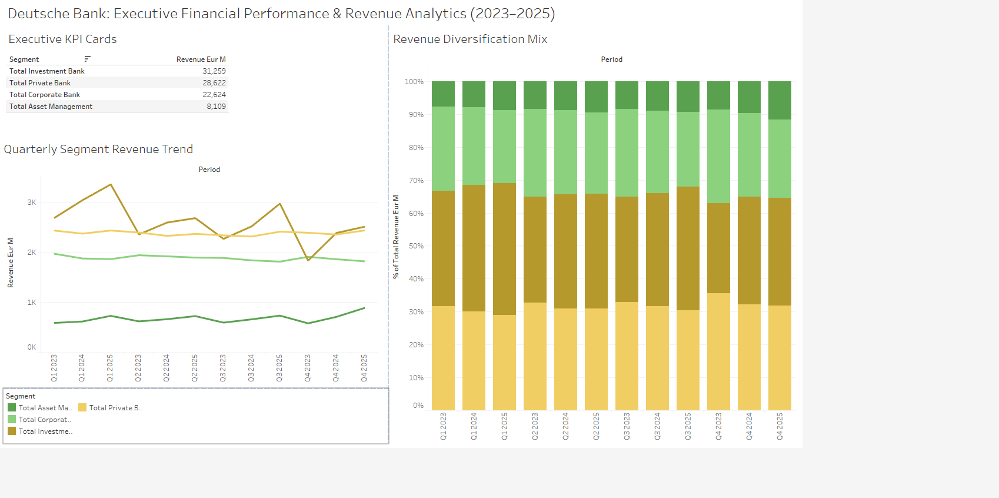

# 🏦 Deutsche Bank Financial Performance & Revenue Analytics (2023–2025)


## 📌 Executive Summary & Data Story

Over the 12-quarter period from **Q1 2023 through Q4 2025**, Deutsche Bank generated **€90.6 Billion** in combined revenue across its four core operating divisions. 

### Key Business Insights:
* **The Revenue Engine:** **Investment Banking** generated **€31.26 Billion** (**34.5%** of total revenue), peaking in **Q1 2025 at €3.36B**. It demonstrated strong momentum with a **+30.1% YoY surge in Q4 2024**.
* **The Stabilizing Pillars:** **Private Banking** (**€28.62B / 31.6%**) and **Corporate Banking** (**€22.62B / 25.0%**) provided reliable, recurring income, accounting for over **56%** of core operating revenue to offset market volatility.
* **Expanding Horizons:** **Asset Management** sustained steady growth, expanding its share of annual bank revenues from **8.80% in 2024** to **9.59% in 2025**.

---

## 🛠️ End-to-End Pipeline Architecture

Messy Excel Reports]
│
▼ (Python & Pandas)
[Automated ETL & Unpivoting]
│
▼ (SQLite Database)
[SQL Window Functions (QoQ / YoY)]
│
▼ (Matplotlib & Tableau)
[Executive Dashboards & Charts]

---

## 💻 Tech Stack & Key Features

* **Python (Pandas):** Built a custom ETL cleaning engine using dynamic list comprehensions, `pd.melt()`, and type-safe coercion (`pd.to_numeric`) to normalize messy financial reporting layouts.
* **SQL (SQLite):** Authored advanced analytical queries utilizing Common Table Expressions (CTEs) and window functions (`LAG()`) to compute Quarter-over-Quarter ($\text{QoQ}$) and Year-over-Year ($\text{YoY}$) growth rates.
* **Tableau & Matplotlib:** Designed interactive executive dashboards and high-resolution visual trend reports.

---

## 📊 Sample SQL Query (YoY Growth Calculation)

```sql
WITH ordered_quarters AS (
    SELECT 
        period,
        revenue_eur_m,
        SUBSTR(period, 4, 4) AS yr,
        SUBSTR(period, 1, 2) AS qtr
    FROM net_revenues
    WHERE segment = 'Total Investment Bank'
    ORDER BY yr ASC, qtr ASC
)
SELECT 
    period,
    ROUND(revenue_eur_m, 2) AS current_rev_m,
    ROUND(LAG(revenue_eur_m, 4) OVER (), 2) AS same_qtr_prev_yr_m,
    ROUND(((revenue_eur_m - LAG(revenue_eur_m, 4) OVER ()) / LAG(revenue_eur_m, 4) OVER ()) * 100, 2) AS yoy_growth_pct
FROM ordered_quarters;

```

## 🖼️ Dashboard & Visual Analytics

### Tableau C-Suite Executive Dashboard


